# Gong to GitHub Sync

[](https://github.com/marketplace/actions/gong-to-github-sync)
[](https://github.com/sderosiaux/gong-to-github/releases)
[](https://opensource.org/licenses/MIT)

Sync Gong call transcripts to GitHub as searchable Markdown files, organized by client.

```mermaid
flowchart LR
    subgraph Gong
        A["📞 Calls"]
        B["📝 Transcripts"]
    end

    subgraph GitHub Action
        C["🔄 Sync"]
        D["Convert to Markdown"]
    end

    subgraph GitHub Repo
        E["📁 client-a/*.md"]
        F["📁 client-b/*.md"]
    end

    G["🤖 AI Agents<br/>Search & Analyze"]

    A & B --> C
    C --> D
    D --> E & F
    E & F --> G
```



## Features

- Converts Gong transcripts to Markdown with full metadata
- Incremental sync (only new calls since last sync)
- Organizes by client folder with auto-generated names
- Per-client README index with call history
- Speaker names with timestamps
- Participant roles (internal/external)
- Call duration, system info, and Gong links
- **Claude Code commands** for AI-powered analysis (pain points, churn risk, portfolio insights)

## Quick Start (GitHub Action)

Add this workflow to sync transcripts automatically:

**`.github/workflows/sync-gong.yml`**
```yaml
name: Sync Gong Transcripts

on:
  schedule:
    - cron: "0 6 * * *"  # Daily at 6 AM UTC
  workflow_dispatch:      # Manual trigger

permissions:
  contents: write

jobs:
  sync:
    runs-on: ubuntu-latest
    steps:
      - uses: actions/checkout@v4

      - uses: sderosiaux/gong-to-github@v1
        with:
          gong_access_key: ${{ secrets.GONG_ACCESS_KEY }}
          gong_secret_key: ${{ secrets.GONG_SECRET_KEY }}
```

### Action Inputs

| Input | Required | Default | Description |
|-------|----------|---------|-------------|
| `gong_access_key` | Yes | — | Gong API access key |
| `gong_secret_key` | Yes | — | Gong API secret key |
| `gong_api_url` | No | — | Regional API URL (if applicable) |
| `from_date` | No | last sync | Start date (YYYY-MM-DD) |
| `to_date` | No | today | End date (YYYY-MM-DD) |
| `output_folder` | No | `transcripts` | Folder for markdown files |
| `full_sync` | No | `false` | Re-sync all calls |
| `commit` | No | `true` | Commit and push changes |
| `commit_message` | No | auto | Custom commit message |

### Setting up Secrets

1. Get your Gong API credentials from **Settings → API** in Gong (requires Admin)
2. Go to your GitHub repo → **Settings → Secrets and variables → Actions**
3. Create two secrets:
   - `GONG_ACCESS_KEY` — Your Gong access key
   - `GONG_SECRET_KEY` — Your Gong secret key

## Output Format

```
transcripts/
├── acme-corp/
│   ├── README.md              # Client index
│   ├── 2025-01-04-discovery-call.md
│   └── 2025-01-10-demo-presentation.md
└── bigcorp/
    ├── README.md
    └── 2025-01-05-onboarding-kickoff.md
```

Each transcript file:

```markdown
# Discovery Call with Acme

**Date:** 2025-01-04 14:03
**Duration:** 30 min

**Participants:**
- John Doe (Internal) - Account Executive
- Jane Smith (External) - VP of Sales

**System:** Zoom | **Type:** External

[View in Gong](https://app.gong.io/call?id=123)

---

## Transcript

**[00:00] John Doe:**
Hi Jane, thanks for joining today!

**[00:05] Jane Smith (Client):**
Happy to be here. Let's dive in.
```

## Why Sync to GitHub?

- **Searchable**: GitHub search + `grep` + IDE search across all calls
- **Version controlled**: See what changed, when, and why
- **No Gong license needed**: Anyone on the team can read transcripts
- **AI-ready**: Feed to RAG systems, LLMs, or analysis pipelines
- **Portable**: Markdown works everywhere
- **Organized**: Find all conversations with a specific client instantly

## Claude Code Commands

This repo includes [Claude Code](https://docs.anthropic.com/en/docs/claude-code) slash commands for AI-powered transcript analysis. After syncing, run these from your repo:

| Command | Description |
|---------|-------------|
| `/analyze-transcript <file>` | Extract pain points, objections, buying signals, stakeholders, and action items from a single call |
| `/analyze-client-history <folder>` | Synthesize all calls for one client into relationship insights, health score, and churn risk |
| `/analyze-portfolio` | Aggregate all clients into portfolio-level insights with strategic recommendations |

```bash
# Example usage in Claude Code
/analyze-transcript transcripts/acme-corp/2025-01-04-discovery-call.md
/analyze-client-history transcripts/acme-corp
/analyze-portfolio
```

The commands use parallel agents for speed — a portfolio with 50 clients spawns 50 concurrent analyses.

## Local Usage

For testing or one-off syncs.

### Prerequisites

- Python 3.11+
- Gong API credentials

### Installation

```bash
pip install git+https://github.com/sderosiaux/gong-to-github.git
```

### Commands

```bash
# Set credentials
export GONG_ACCESS_KEY=your-access-key
export GONG_SECRET_KEY=your-secret-key

# List available calls
gong-sync list-calls --from-date 2024-01-01

# Preview locally
gong-sync sync-local --output-dir ./preview

# Sync to GitHub (with token)
export GITHUB_TOKEN=your-token
gong-sync sync-github --repo owner/repo
```

### CLI Options

| Option | Description |
|--------|-------------|
| `--from-date` | Start date (YYYY-MM-DD) |
| `--to-date` | End date (YYYY-MM-DD) |
| `--full-sync` | Ignore state, sync all calls |
| `--update-existing` | Overwrite existing files |
| `--dry-run` | Preview without pushing |

## Rate Limits

Gong API limits: 3 req/sec, 10,000 req/day. The tool handles rate limiting with exponential backoff.

## Development

```bash
git clone https://github.com/sderosiaux/gong-to-github.git
cd gong-to-github
pip install -e ".[dev]"
pytest
```

## License

MIT
